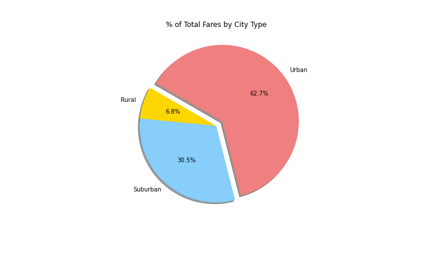
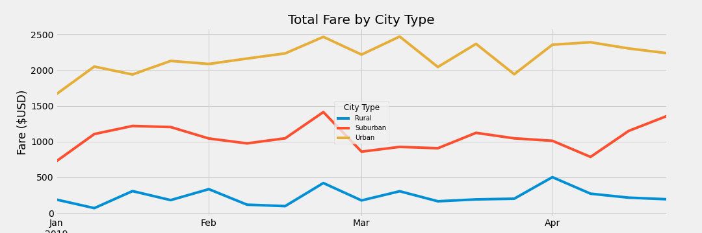

# Pyber_analysis

## **Overview of the analysis**
Performing analysis to show relation between type of city, driver and fare and creating visualizations using the outcome data to help improve access to rideshare services and determine affordability for underserved areas.

##**Results**

Multiple-line graph, created by using Pandas and Matplotlib, shows the total weekly fares for each city type. The graph illustrates that there is a larger demand for PyBer among riders in urban cities compared to suburban and rural cities. Therefore, weekly fare is much higher than the other types of cities. 

##**Summary**

Based on the results, Pyber ride sharing company can adopt several changes to its operations. First of all, increasing the number of drivers in rural cities which can lower the average fare for riders. Lower rate will increase the demand for rides that will have positive impact in the long run. Also, due to its demand urban city drivers earn more than the rural or suburban drivers. Thus, offering incentives for drivers who can work in rural areas may help spreading the number of drivers between cities. Last but not least, offering discounts for rural area riders could have potential to increase the number of riders. 
 

